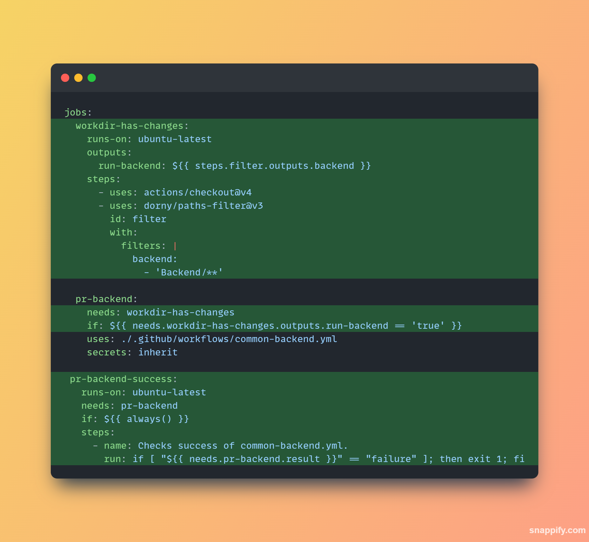

# Change detection based workflows

## To use them on reusable workflows:

_Reusable workflows might have different parameters. Refer to the specific workflows input variables and steps_

### Generic approach

Add the parameters `CHECK_` parameters configuration to the workflow.

-   `CHECK_WORKDIR_CHANGES`: General toggle for the feature. When off it ignores workdir changes detection and always runs the next jobs

-   `CHECK_CUSTOM_DIR`: Specifies a custom DIR to check (use as override dir when the dir to check is differnt from the `WORKING_DIRECTORY`)

-   `CHECK_CHANGES_BY_JOBS`: String array that specifies the job id where this dir check is ran. Default is `'all'`. (ex: `"['dotnet-common']"`)

## To implement and use them on custom/local workflows:

1. Add a job (ex: `workdir-has-changes`) that checks for changes on specific directories and outputs a variable (ex: `run-backend`) which stores `true` if it has detected changes or `false` if it didn't

2. Add a job (ex: `pr-backend-success`) that fails when the child steps fails and succeeds when child jobs succeed or get skipped.
   This will be the job that will be set on the branch protection policy

3. Add a `needs` statement that refers to the check-changes job (ex: `workdir-has-changes`)

4. Add an `if` statement that refers to the changes output variable (ex: `needs.workdir-has-changes.outputs.run-backend`) and skips the job if it evaluates to false

### Full example

```yml
jobs:
  workdir-has-changes:
    runs-on: ubuntu-latest
    outputs:
      run-backend: ${{ steps.filter.outputs.backend }}
    steps:
      - uses: actions/checkout@v4
      - uses: dorny/paths-filter@v3
        id: filter
        with:
          filters: |
            backend:
              - 'Backend/**'

  pr-backend:
    needs: workdir-has-changes
    if: ${{ needs.workdir-has-changes.outputs.run-backend == 'true' }}
    uses: ./.github/workflows/common-backend.yml
    secrets: inherit

 pr-backend-success:
   runs-on: ubuntu-latest
   needs: pr-backend
   if: ${{ always() }}
   steps:
     - name: Checks success of common-backend.yml.
       run: if [ "${{ needs.pr-backend.result }}" == "failure" ]; then exit 1; fi
```


